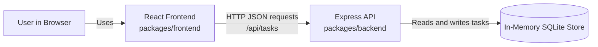

# Cloud Architecture Overview

## System Context

This monorepo contains a browser-based React frontend and an Express API backend. The frontend sends task management requests to the API, and the API stores task data in an in-memory SQLite database.

If Mermaid preview is not available in your editor, use the standalone source file at [docs/cloud-architecture-overview.mmd](docs/cloud-architecture-overview.mmd) or the text version below.



## Text Version

```text
User in Browser
    -> React Frontend (packages/frontend)
    -> Express API (packages/backend) via /api/tasks
    -> In-Memory SQLite Store
```

## Notes

- The frontend and backend are developed together in the same npm workspace monorepo.
- The API currently uses an in-memory database, so data is reset when the backend process restarts.
- This diagram is intended as a high-level system context view, not a deployment diagram.